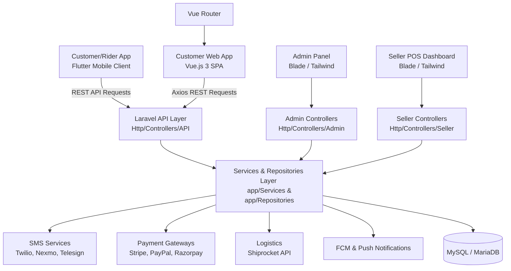

# Project Overview: Ready eCommerce (Apolo)

A comprehensive architectural and system-level breakdown of the Ready eCommerce application, representing a multi-vendor, multi-service platform containing a robust backend dashboard, an interactive customer web storefront, and a multi-service mobile application.

---

## 1. Project Summary

**Ready eCommerce** is a production-ready, feature-rich multi-vendor digital commerce ecosystem designed for a variety of logistics and shopping niches. The application has been designed to serve several distinct business modes under a single platform structure:
- **General eCommerce**: Retail shopping with shipping, carts, categories, brands, and discount systems.
- **Food Delivery**: Multi-restaurant and food delivery tracking.
- **Grocery Delivery**: Fresh grocery inventory, shopping lists, and local store delivery.
- **Pharmacy Delivery**: Health and medicine storefronts with prescription-based ordering logistics.

The system supports four distinct user/stakeholder profiles:
1. **System Administrator (Admin)**: Monitors global settings, manages global catalogues, runs payment/SMS configs, handles PWA configurations, manages platform subscriptions, and tracks analytics.
2. **Shop Owners (Sellers)**: Customize local store profiles, manage individual inventories, set up Point of Sale (POS) operations, handle billing invoices, track local transactions, and request withdrawals.
3. **Delivery Personnel (Riders)**: Track order delivery locations, calculate distances using mapping routes, accept/reject assignments, and view earnings logs.
4. **Customers**: Access services via the Vue.js Single Page Application (SPA) web client or the Flutter mobile application, perform shopping, track live order status, and make transactions.

---

## 2. Technology Stack

The project relies on modern, premium, and performant frameworks for both the backend administrative dashboards, the customer web portal, and the cross-platform mobile application.

### Backend Framework & Database
| Tech Component | Version | Description / Role |
| :--- | :--- | :--- |
| **PHP** | `^8.2` | Core backend programming language. |
| **Laravel Framework** | `v11.45.1` (declared `^11.31` in composer) | Main MVC framework containing API controllers, repository classes, database schema/seeding, queue managers, and backend layouts. |
| **MySQL / MariaDB** | `8.x` | Primary relational database for transaction data, settings, accounts, and catalog details. |
| **Composer** | `2.7.x+` | PHP dependency manager. |

### Web Frontend (Admin, Seller, & Customer Shop)
| Tech Component | Version | Description / Role |
| :--- | :--- | :--- |
| **Vue.js** | `v3.5.17` (declared `^3.4.19` in npm) | Single Page Application (SPA) framework powering the Customer Web Storefront. |
| **Vite** | `^5.0.0` | Next-generation frontend build tool and asset compiler. |
| **TailwindCSS** | `^3.4.1` | Core utility-first styling library for both Vue.js pages and Blade administrative panels. |
| **Pinia** | `^2.1.7` | Reactive state management system for Vue.js. |
| **Vue Router** | `^4.2.5` | Handles SPA routing for customer shopping pages. |
| **Blade Templates** | Laravel Standard | Server-side rendered (SSR) engine used for the Admin Portal and the Seller/POS Dashboard. |

### Mobile Application (Cross-Platform)
| Tech Component | Version | Description / Role |
| :--- | :--- | :--- |
| **Flutter SDK** | `3.35.5` (FVM environment locked version) | UI framework for building Android and iOS applications from a single codebase. |
| **Dart SDK** | `^3.5.0` | Core programming language of Flutter. |
| **Riverpod** | `^2.4.9` | High-performance, compile-safe state management system. |
| **Hive** | `^2.2.3` | Ultra-fast, lightweight key-value database for local app storage. |
| **Android SDK / JDK** | SDK `35.0.0` / JDK `21.0.5` | Build and compile tools for Android APK and App Bundle generation. |

---

## 3. Folder Structure

The root directory contains three main environments: `Document/` (project setup manuals), `Web/` (Laravel backend & Vue frontend), and `Mobile/` (Flutter codebase).

### Global Layout
```
D:\Apolo/
├── Document/                 # Installation Guides, System configs, cPanel instructions
│   ├── assets/               # CSS, JS, Fonts, Images used for documentation pages
│   └── index.html            # Landing page of local installation manuals
├── Mobile/                   # Flutter App codebase
│   ├── android/              # Native Android configuration (Manifest, Gradle, Google Services)
│   ├── ios/                  # Native iOS configuration (Info.plist, Pods, Entitlements)
│   ├── assets/               # Local images, fonts (Mulish), custom SVGs, and translation JSONs
│   ├── lib/                  # Core Dart Source Code
│   └── pubspec.yaml          # Flutter package definitions
└── Web/                      # Laravel Backend & Vue.js Web Frontend
    ├── app/                  # Controller, Repository, Service, and Model logic classes
    ├── config/               # Laravel configuration settings files
    ├── database/             # Database migrations, seeders, and model factories
    ├── public/               # Publicly accessible web assets, icons, and Vite build bundles
    ├── resources/            # Front-end Blade views, Vue.js files, and CSS/Tailwind assets
    ├── routes/               # Modular routing files (Admin, Shop, Api, Rider, Seller)
    └── package.json          # Node dependencies, Vite scripts
```

### Detailed Breakdown of Key Modules

#### A. Laravel App Backend (`Web/app`)
- [app/Http/Controllers/](file:///D:/Apolo/Web/app/Http/Controllers/): Separated by user domains.
  - [API/](file:///D:/Apolo/Web/app/Http/Controllers/API/): Endpoints supporting the Mobile Flutter client.
  - [Admin/](file:///D:/Apolo/Web/app/Http/Controllers/Admin/): Direct controllers for the admin panel.
  - [Seller/](file:///D:/Apolo/Web/app/Http/Controllers/Seller/): Vendor logic controllers.
  - [Shop/](file:///D:/Apolo/Web/app/Http/Controllers/Shop/): Traditional blade controllers.
  - [Gateway/](file:///D:/Apolo/Web/app/Http/Controllers/Gateway/): Payment processing handlers.
- [app/Repositories/](file:///D:/Apolo/Web/app/Repositories/): Isolates database logic. Includes 80+ specific repository files (e.g., `OrderRepository`, `ProductRepository`, `CartRepository`, `WalletRepository`) to streamline queries.
- [app/Services/](file:///D:/Apolo/Web/app/Services/): Houses third-party integrations (Sms Gateways, Shiprocket logistics, push notifications).
- [app/Models/](file:///D:/Apolo/Web/app/Models/): Standard Eloquent models representing database entities (e.g., `User`, `Shop`, `Product`, `Order`, `Voucher`).

#### B. Vue.js SPA Frontend (`Web/resources/js`)
- [App.vue](file:///D:/Apolo/Web/resources/js/App.vue): Main application shell.
- [components/](file:///D:/Apolo/Web/resources/js/components/): Small reusable UI components (buttons, product-cards, loader, modals).
- [pages/](file:///D:/Apolo/Web/resources/js/pages/): Full Vue pages (e.g., `Home.vue`, `Checkout.vue`, `ProductDetails.vue`).
- [router/](file:///D:/Apolo/Web/resources/js/router/): Configuration of SPA page routing.
- [stores/](file:///D:/Apolo/Web/resources/js/stores/): Pinia files tracking user session, cart state, and product details.

#### C. Flutter App Structure (`Mobile/lib`)
- [components/](file:///D:/Apolo/Mobile/lib/components/): Reusable UI widgets.
- [controllers/](file:///D:/Apolo/Mobile/lib/controllers/): Riverpod states regulating business logic.
- [models/](file:///D:/Apolo/Mobile/lib/models/): Data serialization models matching API response objects.
- [services/](file:///D:/Apolo/Mobile/lib/services/): Handles HTTP connections (Dio), local data (Hive), dynamic localization, mapping APIs, and background push messaging.
- [views/](file:///D:/Apolo/Mobile/lib/views/): Segregated by business niches:
  - `common/`: Splash, authentication, offline indicators.
  - `eCommerce/`: Store screens, carts, coupon widgets.
  - `food/`: Restaurant lists, menu details, dish detail screens.
  - `grocery/`: Multi-aisle listings, fresh produce catalogs.
  - `pharmacy/`: Pharmacy listings, prescription upload interfaces.

---

## 4. Architecture Overview



### Architectural Highlights
- **Repository-Service Pattern**: Controllers delegate core data actions to Repositories. The repositories communicate with the Eloquent ORM. Heavy workflows (like Payment processing, SMS generation, or Shipping APIs) are isolated into dedicated Service classes (under `app/Services`).
- **Decoupled Client Interfaces**:
  - The Admin and Seller portals run on Laravel's built-in MVC structure, compiling views directly on the server to optimize data security and access speed.
  - The Customer storefront is a decoupled client SPA running on the browser, which fetches information using JSON APIs from the same server.
- **Riverpod State Management**: Flutter uses Riverpod, isolating business state and data-fetching events from the widget layout tree.

---

## 5. Important Packages

The platform's capability is extended through a selection of highly reliable libraries.

### PHP / Laravel Packages (`composer.json`)
- **`laravel/sanctum` (`^4.0`)**: Lightweight authentication system generating tokens for API calls made by the Vue storefront and Flutter app.
- **`spatie/laravel-permission` (`^6.3`)**: Allows the creation of roles and direct permissions mapping for administrative personnel and sellers.
- **`nwidart/laravel-modules` (`^10.0`)**: Supports modular development, making it easy to turn services or plug-ins on and off.
- **`maatwebsite/excel` (`^3.1`)**: Used by administrators and sellers to download sales, inventory, and ledger reports as spreadsheet files.
- **`mpdf/mpdf` (`^8.2`) & `milon/barcode` (`^11.0`)**: Crucial for POS operations. Facilitate barcode printing and generation of invoice PDF slips.
- **`kreait/laravel-firebase` (`^5.8`)**: Links the backend directly to Firebase, pushing order alerts to customers and riders.
- **Third-Party Gateways**:
  - *SMS*: Nexmo, Twilio, Messagebird, Telesign.
  - *Payment*: Stripe, Paypal SDK, Razorpay, Paystack.

### Vue.js Packages (`package.json`)
- **`pinia` (`^2.1.7`) & `pinia-plugin-persistedstate` (`^3.2.1`)**: Retain customer carts and auth tokens across browser refreshes.
- **`vue-router` (`^4.2.5`) & `vue-i18n` (`^10.0.1`)**: Handle client-side routing logic and multi-language support.
- **`swiper` (`^11.0.6`)**: Controls sliding banners and promotional carousels.
- **`vue3-google-login` (`^2.0.33`)**: Social login OAuth support.

### Flutter Packages (`pubspec.yaml`)
- **`flutter_riverpod` (`^2.4.9`)**: Application state manager.
- **`hive_flutter` (`^1.1.0`)**: Retains user tokens, language options, theme preferences, and locally stores items in the cart when offline.
- **`dio` (`^5.4.0`)**: High-performance HTTP client featuring request logging (`pretty_dio_logger`) and custom interceptors.
- **`google_maps_flutter` (`^2.14.0`)**: Live map integration.
- **`geolocator` (`^13.0.1`)**: Captures real-time device coordinate coordinates (for calculating delivery fees).
- **`flutter_screenutil` (`^5.9.0`)**: Standardizes UI scaling across varying screen ratios and densities.

---

## 6. Important Modules

1. **POS (Point of Sale)**:
   A critical system module built for physical shops/sellers. Accessible via the Seller portal. Connects directly to barcode scanners, runs a localized cart system (`PosCartRepository`), handles manual customer checkouts, generates cash invoice PDFs, and automatically decrements inventory.
2. **Multi-Vendor Subscriptions**:
   Enables the main Admin to charge vendors recurring subscription fees. Features include custom subscription tier setup, automatic listing restrictions based on selected packages, and recurring billing logic.
3. **Automated Order Dispatching**:
   An algorithmic dispatch system connecting customers, shops, and delivery riders. Once a customer checks out, notification signals are routed via Firebase FCM to active delivery drivers within a specified geographic radius.
4. **Accounting & Ledgers**:
   Sellers and admins access custom accounting modules (tracked through `AccountMasterRepository` and `VoucherEntryRepository`) to view double-entry bookkeeping ledgers, VAT/Tax details, financial years, and pending withdrawal balances.

---

## 7. Development Workflow

The development workflow requires configuring both the Laravel backend server and compiling/bundling the web/mobile clients.

### Backend Setup
1. **Configuring Environment**:
   Duplicate `.env.example` to `.env` and fill in DB details, mail host keys, and Pusher configurations.
2. **Composer Installation**:
   ```bash
   composer install
   ```
3. **Database Migration & Seed**:
   Creates schema tables and populates base parameters (categories, initial admin user, system configs):
   ```bash
   php artisan migrate:fresh --seed
   ```
4. **Storage Symlink**:
   Enables public access to uploaded files:
   ```bash
   php artisan storage:link
   ```
5. **Start Dev Server**:
   ```bash
   php artisan serve
   ```

### Web Frontend Setup
1. **Node Dependencies**:
   ```bash
   npm install
   ```
2. **Local Compilation**:
   Runs Vite's hot-reload server to compile JS/CSS changes on the fly:
   ```bash
   npm run dev
   ```
3. **Production Compiling**:
   Minifies, clean bundles, and packs assets inside `/public/build/`:
   ```bash
   npm run build
   ```

### Mobile App Development
1. **Configuration**:
   Ensure Android/iOS bundle identifiers are modified in configuration setups before linking with Firebase. Setup `DefaultFirebaseOptions` using:
   ```bash
   flutterfire configure
   ```
2. **Fetch Dependencies**:
   ```bash
   flutter pub get
   ```
3. **Auto-Generate Code**:
   Build localization keys and compile build runner adapters (e.g. Hive adapters):
   ```bash
   dart run build_runner build --delete-conflicting-outputs
   flutter pub run intl_utils:generate
   ```
4. **Running locally**:
   ```bash
   flutter run
   ```
5. **Building Release Bundle**:
   - *Android*:
     ```bash
     flutter build apk --release
     # Or for app bundle publishing:
     flutter build appbundle --release
     ```
   - *iOS*:
     ```bash
     flutter build ios --release
     ```
