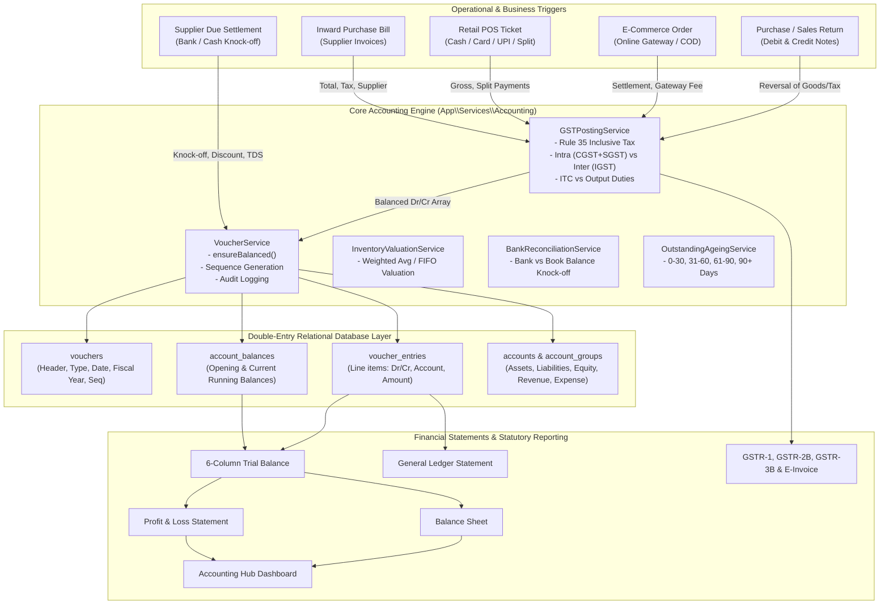
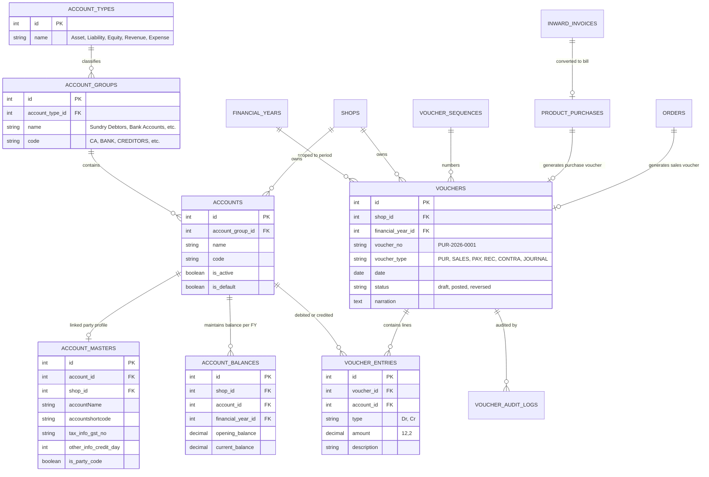

# Apolo ERP: Comprehensive Accounting System Architecture & Implementation Blueprint

## 1. Executive Summary

This document serves as the complete technical and functional blueprint of the **Accounting & Financial Subsystem** developed within the **Apolo ERP** platform.

The accounting subsystem is engineered as an enterprise-grade, **real-time double-entry bookkeeping engine** adhering strictly to standard Chartered Accounting principles and Indian statutory requirements (including GST Rule 35, E-Invoicing, GSTR reporting, and TDS). It provides seamless, automated synchronization between physical inventory, retail POS sales, supplier procurement, customer receivables, and financial ledgers.

### Core Architectural Pillars
1. **Strict Double-Entry Enforcement**: Every financial transaction must satisfy the fundamental equation:  
   $$\sum \text{Debit} = \sum \text{Credit}$$  
   No voucher can be committed to the database in an unbalanced state.
2. **Multi-Tenant & Multi-Branch Ledger Isolation**: Complete data segregation by `shop_id` and `branch_id`, with autonomous financial year sequences and balance sheets per shop.
3. **Automated Transaction Hook Triggers**: Subsystems like Inward Purchases, POS Retail Sales, E-commerce Orders, and Supplier Payments automatically construct and post balanced general journal vouchers without requiring manual accountant intervention.
4. **Comprehensive Financial Reporting**: Instant computation of 6-Column Trial Balance, Profit & Loss Statements (Gross & Net), Balance Sheet, General Ledger statements with running balances, Bank Reconciliation Statements (BRS), and Aging schedules.

---

## 2. Complete Accounting Architecture & Flow Diagram



---

## 3. Master Hierarchy & Chart of Accounts (COA)

The foundation of Apolo's accounting structure is a 4-tier hierarchical Chart of Accounts:
$$\text{Account Types (5)} \longrightarrow \text{Account Groups (21)} \longrightarrow \text{Accounts / General Ledgers (489)} \longrightarrow \text{Party Masters (454)}$$

### Tier 1: The 5 Fundamental Account Types
Defined in database table `account_types`:
1. **Assets** (Normal Balance: `Debit`)
2. **Liabilities** (Normal Balance: `Credit`)
3. **Equity / Capital** (Normal Balance: `Credit`)
4. **Revenue / Income** (Normal Balance: `Credit`)
5. **Expenses** (Normal Balance: `Debit`)

---

### Tier 2: The 21 Standard Account Groups
Defined in database table `account_groups`:

| ID | Group Name | Code | Parent Type | Description & Usage |
| :---: | :--- | :---: | :---: | :--- |
| **1** | Current Assets | `CA` | Assets | Short-term convertible resources, deposits, advances |
| **2** | Fixed Assets | `FA` | Assets | Property, store fixtures, POS hardware, vehicles |
| **3** | Bank Accounts | `BANK` | Assets | Checking, current, and overdraft bank accounts |
| **4** | Cash-in-Hand | `CASH` | Assets | Physical cash registers, petty cash, safe balance |
| **5** | Sundry Debtors | `DEBTORS` | Assets | Customer accounts receivable |
| **6** | Stock-in-Hand / Inventory | `STOCK` | Assets | Value of unsold retail garment inventory |
| **7** | Loans & Advances (Asset) | `ADV_ASSET` | Assets | Employee salary advances, vendor security deposits |
| **8** | Current Liabilities | `CL` | Liabilities | Short-term obligations due within 12 months |
| **9** | Duties & Taxes | `TAX` | Liabilities | GST output/input ledgers, TDS payable, TCS |
| **10** | Sundry Creditors | `CREDITORS` | Liabilities | Merchandise suppliers, vendors, trade payables |
| **11** | Loans (Liability) | `LOAN` | Liabilities | Bank loans, unsecured business borrowings |
| **12** | Provisions | `PROV` | Liabilities | Bad debt reserves, audit fee provisions, bonus provisions |
| **13** | Capital Account | `CAP` | Equity | Owner's investment / equity capital |
| **14** | Reserves & Surplus | `RES` | Equity | Accumulated retained earnings carried forward |
| **15** | Drawings Account | `DRAW` | Equity | Owner personal withdrawals (reduces equity) |
| **16** | Sales Accounts | `SALES` | Revenue | Retail POS sales, wholesale sales, e-commerce revenue |
| **17** | Direct Incomes | `DIR_INC` | Revenue | Tailoring/alteration fees, delivery/shipping charges |
| **18** | Indirect Incomes | `INDIR_INC` | Revenue | Supplier cash discounts earned, bank interest |
| **19** | Purchase Accounts | `PURCHASE` | Expenses | Cost of merchandise purchased for retail sale |
| **20** | Direct Expenses | `DIR_EXP` | Expenses | Inward freight/cartage, customs duty, packaging materials |
| **21** | Indirect Expenses | `INDIR_EXP` | Expenses | Store rent, staff salaries, electricity, payment gateway fees |

---

### Tier 3 & 4: General Ledgers (`accounts`) and Party Masters (`account_masters`)

A critical design innovation in Apolo is the **Dual-Identity Bridge**:
* **`accounts`**: Pure double-entry general ledger accounts mapped to `account_group_id`.
* **`account_masters`**: Commercial entity profiles (suppliers, vendors, retail customers, banks) storing trade attributes:
  * Trade Name (`accountName`), Shortcode (`accountshortcode`)
  * Tax Details: `tax_info_gst_no` (GSTIN), `tax_info_pan_no` (PAN), TAN
  * Credit Terms: `other_info_credit_day`, `other_info_act_limit`
  * Contact & Geography: Mobile, Address, Country ID, State ID, City ID
  * **Linkage**: `account_masters.account_id` foreign-keys directly into `accounts.id`.
  * **Party Code Identifier**: `is_party_code = 1` signifies trade debtors/creditors eligible for procurement and invoice attribution.

---

## 4. Core Voucher Engine & Double-Entry Mechanics

All financial operations pass through `App\Services\Accounting\VoucherService.php`.

### The 6 Voucher Types (`voucher_types`)
1. **Purchase Voucher (`PUR`)**: Records supplier bills and creates merchandise payable.
2. **Sales Voucher (`SALES`)**: Records retail POS and online customer sales revenue.
3. **Payment Voucher (`PAY`)**: Cash or bank outflows to suppliers or expense accounts.
4. **Receipt Voucher (`REC`)**: Inflows from customers, COD remittance, or other income.
5. **Contra Voucher (`CONTRA`)**: Fund transfers between internal liquid accounts (e.g., Cash Deposit into Bank, Cash Withdrawal from Bank to Register).
6. **Journal Voucher (`JOURNAL`)**: Non-cash adjustments, depreciation, opening balance calibrations, bad debts.

---

### Sequential Numbering Engine (`voucher_sequences`)
Apolo implements gapless, branch-scoped, fiscal-year-aware numbering:
* Formula: `[Prefix] + str_pad([Current_No], [Padding], '0', STR_PAD_LEFT)`
* Example: `PUR-2026-000142`
* Automatic yearly reset policy.
* Concurrency safe: numbers are locked and updated inside database transactions.

---

### Double-Entry Validation & Posting Logic

```php
// app/Services/Accounting/VoucherService.php
public function create(array $data): Voucher
{
    return DB::transaction(function () use ($data) {
        // 1. Mandatory Equilibrium Assertion: Sum(Dr) == Sum(Cr)
        $this->ensureBalanced($data['entries'] ?? []);

        // 2. Next Sequence Number Generation (Thread-Safe)
        $seq = $this->upsertSequence($data);
        $next = $seq->current_no + 1;
        $seq->current_no = $next;
        $seq->save();
        $voucherNo = ($seq->prefix ?? '') . str_pad((string)$next, $seq->padding, '0', STR_PAD_LEFT);

        // 3. Create Voucher Header
        $voucher = Voucher::create([
            'voucher_no'        => $voucherNo,
            'voucher_type'      => $data['voucher_type'],
            'status'            => 'posted',
            'date'              => $data['date'],
            'narration'         => $data['narration'] ?? null,
            'shop_id'           => $data['shop_id'],
            'financial_year_id' => $data['financial_year_id'],
            'branch_id'         => $branchId,
        ]);

        // 4. Create Individual Debit / Credit Entries & Apply Running Balance
        foreach ($data['entries'] as $e) {
            VoucherEntry::create([
                'voucher_id' => $voucher->id,
                'account_id' => $e['account_id'],
                'type'       => $e['type'], // 'Dr' or 'Cr'
                'amount'     => round((float)$e['amount'], 2),
                'description'=> $e['description'] ?? null,
            ]);

            $this->applyToBalance($e['account_id'], $voucher->shop_id, $e['type'], $e['amount']);
        }

        return $voucher;
    });
}
```

---

## 5. Automated Transaction Accounting Flows

### Flow 1: Supplier Purchase Bill Posting (Inward Purchase)
When an Inward Invoice is finalized into a Purchase Bill (`PurchaseController::store`):
* **Debit**: Purchase Account (`PURCHASE`, Group 19) &rarr; Net Taxable Amount
* **Debit**: Input GST ITC Ledgers (`TAX`, Group 9):
  * Intra-State: `DUTY_CGST_IN` + `DUTY_SGST_IN`
  * Inter-State: `DUTY_IGST_IN`
* **Credit**: Supplier Creditor Account (`CREDITORS`, Group 10, linked to `account_masters.account_id`) &rarr; Gross Bill Amount
* **Credit / Debit**: Round-off Account (`EXP_ROF`, Group 21) &rarr; Cent adjustment

---

### Flow 2: Retail POS Sales Ticket Posting
When a retail sale is tendered at the POS terminal (`OrderController`):
* **Debit**: Cash in Hand (`CASH`, Group 4) or Bank (`BANK`, Group 3) &rarr; Tendered Amount
* **Credit**: Retail Sales Account (`SALES`, Group 16) &rarr; Taxable Base Price
* **Credit**: Output GST Duties (`TAX`, Group 9):
  * Intra-State: `DUTY_CGST_OUT` (CGST Output) + `DUTY_SGST_OUT` (SGST Output)
  * Inter-State: `DUTY_IGST_OUT` (IGST Output)
* **Inventory Hook**: Barcode marked `is_sold = 1`; stock valuation updated.

---

### Flow 3: Supplier Due Payment & Bill Knock-Off
When settling supplier payables (`SupplierDuePaymentController::storePayment`):
* **Debit**: Supplier Creditor Account (`CREDITORS`, Group 10) &rarr; Full Invoice Amount Settled
* **Credit**: Bank Account (`BANK`, Group 3) or Cash Register (`CASH`, Group 4) &rarr; Net Paid
* **Credit**: Cash Discount Received (`INDIR_INC`, Group 18) &rarr; Discount Amount
* **Credit**: TDS Payable (`TAX`, Group 9) &rarr; Deducted TDS under Sec 194Q / 194C

---

### Flow 4: Purchase Return & Debit Note Posting
When returning merchandise to a supplier (`PurchaseReturnService::createReturnDebitNote`):
* **Debit**: Supplier Creditor Account (`CREDITORS`, Group 10) &rarr; Total Return Value
* **Credit**: Purchase Returns (`PURCHASE`, Group 19) &rarr; Taxable Value of Returned Goods
* **Credit**: Reversal of Input Tax Credit (`TAX`, Group 9) &rarr; Reversal of CGST/SGST/IGST

---

## 6. Complete Inventory of Accounting Services (15 Services)

Located in `app/Services/Accounting/`:

| # | Service Class | Key Functions & Responsibilities |
| :---: | :--- | :--- |
| **1** | `VoucherService.php` | Core double-entry posting engine, balance assertion, sequence numbering, audit logging, voucher reversal. |
| **2** | `FinancialStatementService.php` | Generates 6-Column Trial Balance, Profit & Loss, Balance Sheet, and General Ledger with chronological running balances. |
| **3** | `GSTPostingService.php` | Rule 35 inclusive tax formula extraction, Place of Supply determination (intra vs inter-state), automated GST posting. |
| **4** | `SupplierPaymentService.php` | Supplier payment execution, multi-bill allocation/knock-off, discount accounting, payment vouchers. |
| **5** | `PurchaseReturnService.php` | Debit note generation for supplier returns, inventory deduction, and tax credit reversal. |
| **6** | `OutstandingAgeingService.php` | Computes debtor receivables and creditor payables aging buckets (0-30, 31-60, 61-90, 90+ days). |
| **7** | `BankReconciliationService.php` | Matches physical bank statement lines with ERP book vouchers; flags uncredited cheques and uncleared deposits. |
| **8** | `InventoryValuationService.php` | Calculates closing inventory balance using Weighted Average Cost and FIFO for Balance Sheet asset valuation. |
| **9** | `CanonicalInventoryService.php` | Synchronizes inventory unit movements with general ledger stock accounts to prevent physical-vs-book drift. |
| **10** | `CodSettlementService.php` | Manages logistics courier cash-on-delivery receivable ledgers, courier remittance reconciliation, and COD fee posting. |
| **11** | `OnlineOrderAccountingService.php` | Handles payment gateway fees (Razorpay, Stripe, Cashfree), customer receivables, and online order accounting. |
| **12** | `Gstr1ReportingService.php` | Compiles Indian statutory GSTR-1 returns: Table 4A (B2B), 5A (B2C Large), 7 (B2C Small), 12 (HSN Summary). |
| **13** | `Gstr2bReconciliationService.php` | Reconciles purchase vouchers against government portal GSTR-2B JSON to maximize eligible Input Tax Credit (ITC). |
| **14** | `Gstr3bService.php` | Computes monthly statutory summary return GSTR-3B: Outward taxable supplies, eligible ITC, net tax payable. |
| **15** | `GstEInvoiceService.php` | Connects with IRP portal for B2B E-Invoicing, generating Invoice Reference Number (IRN) and signed QR code. |

---

## 7. Inventory of Accounting Pages & UI Reports

### Navigation: Shop Portal &rarr; Section 4: Accounting & Finance

```
├── Accounting Hub Dashboard                 [/shop/accounting/dashboard]
├── Books & Vouchers
│   ├── General Journal & Vouchers           [/shop/accounting/vouchers]
│   ├── General Ledger Statement             [/shop/accounting/general-ledger]
│   ├── Trial Balance, P&L, Balance Sheet    [/shop/reports/financial-statements]
│   ├── Purchase Returns & Debit Notes       [/shop/accounting/purchase-returns]
│   ├── Supplier Bill Settlements            [/shop/accounting/supplier-payments]
│   ├── Supplier Credit Dues (Credit Days)   [/shop/supplier-due-payment]
│   ├── COD Remittance & Settlement          [/shop/accounting/cod-reconciliation]
│   └── Closing Inventory Valuation          [/shop/accounting/inventory-valuation]
├── Ledgers & Masters
│   ├── Account Master (Suppliers/Parties)   [/shop/account-master]
│   ├── Account Balance (Opening/Running)    [/shop/account-balance]
│   ├── Bank Master (Bank Accounts/IFSC)     [/shop/bank-master]
│   ├── Counter Master (POS Day Books)       [/shop/counter-master]
│   ├── TDS Master (Sec 194C, 194J, 194Q)    [/shop/tds-master]
│   └── HSN Master (GST Slabs & Rates)       [/shop/hsn-master]
└── Statutory & Compliance (Admin/Shop)
    ├── GST Compliance Hub (GSTR-1, 2B, 3B)  [/shop/gst-dashboard]
    ├── Bank Reconciliation Statement (BRS)  [/shop/bank-reconciliation]
    └── Outstanding Debtors/Creditors Aging  [/shop/outstanding-ageing]
```

---

## 8. Database Schema: Entity Relationship Model



---

## 9. Step-by-Step Accounting Implementation Playbook

If you are researching or setting up an accounting system on another platform, follow this exact sequence:

### Step 1: Initialize Calendar & Financial Years
* Create table `financial_years` with `start_date` and `end_date` (e.g., April 1 to March 31 in India; January 1 to December 31 in Western jurisdictions).
* Enforce active fiscal year flags and date validation triggers.

### Step 2: Seed the Chart of Accounts Hierarchy
1. Seed the **5 Account Types**: Assets, Liabilities, Equity, Revenue, Expenses.
2. Seed the **21 Standard Account Groups** (Current Assets, Bank Accounts, Cash-in-Hand, Sundry Debtors, Sundry Creditors, Duties & Taxes, Sales Accounts, Purchase Accounts, etc.).
3. Seed **System Default Control Accounts**:
   * Cash-in-Hand (`CASH_MAIN`)
   * Bank Clearing (`BANK_MAIN`)
   * Round-Off Adjustment (`EXP_ROF`)
   * Default Merchandise Purchase (`PUR_LOCAL`)
   * Default Retail POS Sales (`SALE_RETAIL`)
   * GST Duties: `DUTY_CGST_IN`, `DUTY_SGST_IN`, `DUTY_IGST_IN`, `DUTY_CGST_OUT`, `DUTY_SGST_OUT`, `DUTY_IGST_OUT`

### Step 3: Configure Tax Masters & Slabs
* Set up GST tax master (`vat_taxes`: 0%, 5%, 12%, 18%, 28%).
* Set up HSN codes (`hsn_masters` & `hsn_sub_masters`) with rate slab thresholds (e.g., apparel under ₹1000 @ 5%, above ₹1000 @ 12%).
* Configure statutory TDS sections (`tds_masters`: 194C, 194J, 194Q) with deduction thresholds and percentage rates.

### Step 4: Configure Liquid Accounts & POS Counters
* Set up Bank accounts (`bank_masters`) with account number, IFSC, and linkage to an account in Group 3 (`BANK`).
* Set up POS Counters / Day Books (`counter_masters`) for multi-terminal retail cash drawers.

### Step 5: Onboard Commercial Parties (Suppliers & Customers)
* Create party master records (`account_masters`) with trade name, GSTIN, PAN, and credit days.
* Automatically generate a corresponding entry in `accounts` under Group 10 (`Sundry Creditors`) for vendors or Group 5 (`Sundry Debtors`) for customers.
* Capture opening balances in `account_balances` per financial year.

### Step 6: Define Voucher Sequence Rules
* Implement `voucher_sequences` table with prefix, padding length (e.g., 6 digits), yearly reset rules, and sequence reservation locks.

### Step 7: Wire Automated Transaction Listeners
* Inward / Procurement Module &rarr; Triggers `VoucherService::create` with `voucher_type = 'PUR'` upon finalization.
* Retail POS Billing &rarr; Triggers `VoucherService::create` with `voucher_type = 'SALES'` upon payment completion.
* Supplier Due Payments &rarr; Triggers `VoucherService::create` with `voucher_type = 'PAY'` upon cash/bank payout.
* Customer / Vendor Returns &rarr; Triggers Debit / Credit Note vouchers with tax reversal.

### Step 8: Build Verification & Financial Reporting Engines
* Implement the 6-Column Trial Balance query:
  $$\text{Net Closing} = (\text{Opening Dr} + \text{Period Dr}) - (\text{Opening Cr} + \text{Period Cr})$$
* Derive the Profit & Loss statement from Groups 16-21 (Revenue - Expenses).
* Derive the Balance Sheet from Groups 1-15 (Assets = Liabilities + Equity + Net Profit).
* Build automated ledger balancing audits to alert if any voucher has $\text{Debit} \ne \text{Credit}$.
