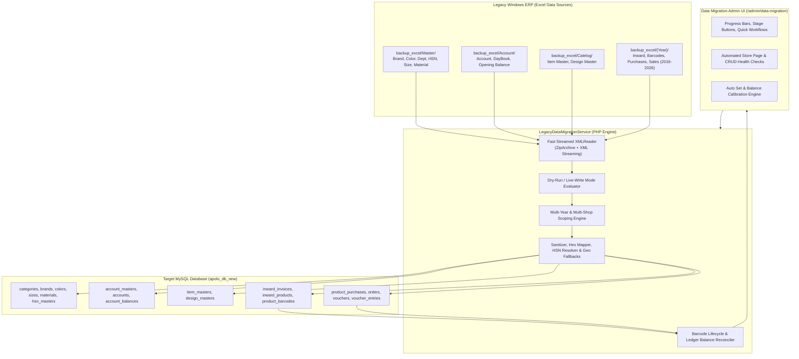

# Legacy ERP Data Migration: Comprehensive Project Analysis & Technical Blueprint

## 1. Executive Summary

This document provides an in-depth technical and architectural analysis of the **Data Migration Subsystem** implemented in the **Apolo ERP** platform. 

The primary objective of this migration subsystem is to ingest, sanitize, transform, and reconcile over a decade of retail ERP data (spanning financial years **2016 through 2026**) from a legacy Windows-based desktop retail garment ERP into the modern, multi-tenant web-based Laravel ERP (`Apolo`).

### Core Business Domains Migrated
1. **Foundation Masters**: Financial calendar years, store departments/categories, apparel brands, color master with hex palettes, size masters, material types, and Indian GST HSN codes with rate slabs.
2. **Financial Accounts & Ledgers**: Supplier and customer party accounts, contact details, tax identifiers (GSTIN, PAN), default geographic fallbacks, and opening debit/credit balances.
3. **Merchandise Catalog**: Item masters (product taxonomy, brand/category/HSN linkages) and design masters (SKUs, purchase rates, MRP, markups, markdowns, and supplier links).
4. **Warehouse Inventory & Barcodes**: Stock inward challans, multi-row inward item receipts, opening stock initialization, and individual item barcode generation.
5. **Purchases, POS Sales & Double-Entry Accounting**: Supplier purchase invoices, voucher generation, POS sales tickets, barcode stock lifecycle (`is_sold`), and automated ledger balancing (`Dr == Cr`).

---

## 2. Migration System Architecture



### Key Components

| Component | File Path | Responsibilities |
| :--- | :--- | :--- |
| **Migration Service Engine** | `app/Services/Migration/LegacyDataMigrationService.php` | 3,920 lines of procedural and batching logic, low-level XLSX streaming, transformations, dry-run simulation, and database writes. |
| **Admin Controller** | `app/Http/Controllers/Admin/DataMigrationController.php` | HTTP entry points for step execution, stage clearing, manual file uploads, page health checks, and account reconciliation. |
| **Admin Dashboard View** | `resources/views/admin/data-migration/index.blade.php` | Live UI with year switcher, stage execution dropdowns, individual step triggers, dry-run toggle, and status badges. |
| **Source Excel Directory** | `backup_excel/` | Hierarchically structured backup repository containing root master files and year-based subfolders (`2016` to `2026`). |

---

## 3. High-Performance Streaming XML Architecture

A major architectural challenge in retail data migrations is file size. For example, `Design Master.xlsx` has over 30,500 rows, and `Barcode Search.xlsx` spans tens of thousands of serial numbers. Traditional libraries like `PhpSpreadsheet` load the entire DOM tree into memory, easily exhausting PHP's memory limit (often exceeding 512 MB to 1 GB) and timing out.

### How Apolo Solved This:
The migration service bypasses high-level spreadsheet parsers and interacts directly with the OpenXML structure:
1. **Shared Strings Extraction (`xl/sharedStrings.xml`)**:
   - Opens the `.xlsx` container using PHP's native `ZipArchive`.
   - Streams the shared strings table with `XMLReader` and constructs an indexed string table.
2. **Worksheet Streaming (`xl/worksheets/sheet1.xml`)**:
   - Streams the raw XML rows sequentially via `XMLReader`.
   - Extracts cell coordinates (`A3`, `B3`, etc.) and maps string references to shared string values.
   - Invokes a streaming row callback `rowCallback($cells, $headers, $rowNum)` so only one row exists in memory at any given time.
3. **Ultra-Fast Row Counting (`getFastRowCount`)**:
   - Reads chunks of 64 KB from the XML stream and counts `<row ` occurrences across buffer boundaries.
   - Can count 40,000 rows in less than 50 milliseconds without parsing XML nodes.

---

## 4. The 5 Migration Stages & 15 Granular Steps

The migration pipeline is organized into **5 logical stages** comprising **15 sequential steps**. This dependency ordering guarantees that foreign keys always point to pre-existing parent records.

```
Stage 1: Foundation Masters  --> Steps 1 to 7   (Years, Depts, Brands, Colors, Sizes, Materials, HSN)
Stage 2: Accounts & Balances --> Steps 8 & 9   (Account Masters, Opening Balances)
Stage 3: Catalog Hierarchy   --> Steps 10 & 11  (Item Masters, Design Masters)
Stage 4: Inward & Barcodes   --> Steps 12 & 13  (Inward Challans, Serialized Barcodes)
Stage 5: Purchases & Sales   --> Steps 14 & 15  (Purchase Invoices, POS Sales, Accounting Vouchers)
```

---

### STAGE 1: FOUNDATION MASTERS (Steps 1 – 7)

#### Step 1: Financial Years
- **Source File**: `backup_excel/Master/Financial Year.xlsx`
- **Target Table**: `financial_years`
- **Description**: Defines financial accounting periods (e.g., `2016-2017`, `2021-2022`) with `start_date`, `end_date`, and status flags.
- **Current DB Count**: 11 records.

#### Step 2: Department Master / Categories
- **Source File**: `backup_excel/Master/Department Master.xlsx`
- **Target Tables**: `categories`, `shop_categories`
- **Description**: Retail departments (e.g., Boys, Girls, Mens, Ladies, Kids) mapped as root and sub-categories. Automatically creates shop-category pivot relationships for the active shop.
- **Current DB Count**: 41 records.

#### Step 3: Brand Master
- **Source File**: `backup_excel/Master/Brand.xlsx`
- **Target Table**: `brands`
- **Description**: Manufacturer and garment brand labels.
- **Current DB Count**: 869 records.

#### Step 4: Color Master (With Automatic Hex Palette Mapping)
- **Source File**: `backup_excel/Master/Color.xlsx`
- **Target Table**: `colors`
- **Transformation Logic**: Legacy ERPs only store color names (e.g., `RAMA GREEN`, `FIROZI BLUE`, `RUST`). The migration engine contains a built-in dictionary mapping 150+ color names to curated, web-standard hex codes (e.g., `RAMA GREEN` &rarr; `#008B8B`, `RUST` &rarr; `#B7410E`), falling back to a deterministic hash color for unrecognized names.
- **Current DB Count**: 2,573 records.

#### Step 5: Size Master
- **Source File**: `backup_excel/Master/Size.xlsx`
- **Target Table**: `sizes`
- **Description**: Apparel sizing labels (e.g., `S`, `M`, `L`, `XL`, `XXXL`, `28`, `32`, `36`).
- **Current DB Count**: 149 records.

#### Step 6: Material List
- **Source File**: `backup_excel/Master/Material List.xlsx`
- **Target Table**: `materials`
- **Description**: Material classifications (Goods, Stationery, Packing).
- **Current DB Count**: 3 records.

#### Step 7: HSN Code Master & GST Slabs
- **Source File**: `backup_excel/Master/HSN Code_data.xlsx` (Fallback: `HSN Code.xlsx`)
- **Target Tables**: `hsn_masters`, `hsn_sub_masters`
- **Critical Insight / Root-Cause Fix**:
  - `HSN Code.xlsx` only contained 441 top-level HSN headers where rate fields were 0.
  - `HSN Code_data.xlsx` contains the actual 1,411 GST tax slab rules with effective dates, sales/purchase price limits, and tax percentages (0%, 5%, 12%, 18%, 28%).
  - The migration engine dynamically resolves `vat_taxes.id` by matching IGST/SGST percentages.
- **Current DB Count**: 441 HSN headers, 1,411 HSN slab sub-masters.

---

### STAGE 2: FINANCIAL ACCOUNTS & OPENING BALANCES (Steps 8 & 9)

#### Step 8: Account Master & Ledgers
- **Source File**: `backup_excel/Account/Account.xlsx`
- **Target Table**: `account_masters`
- **Transformation & Geographic Fallbacks**:
  - Legacy party codes (`accountshortcode`) are imported as unique accounts.
  - Distinguishes party suppliers/debtors/creditors (`is_party_code = 1`).
  - **Fallback Rule**: When the legacy spreadsheet lacks country, state, or city values, the system dynamically queries and links:
    - `country_id` &rarr; India
    - `state_id` &rarr; Gujarat
    - `city_id` &rarr; Unjha
- **Current DB Count**: 454 records.

#### Step 9: Opening Balances
- **Source File**: `backup_excel/Account/Opening Balance.xlsx`
- **Target Table**: `account_balances`
- **Description**: Migrates opening debit (`Dr`) and credit (`Cr`) ledger balances per account, mapped to the corresponding financial year ID.
- **Current DB Count**: 65 records.

---

### STAGE 3: MERCHANDISE CATALOG (Steps 10 & 11)

#### Step 10: Item Master
- **Source File**: `backup_excel/Catelog/Item Master.xlsx`
- **Target Table**: `item_masters`
- **Relationships**:
  - Links to `brands.id` (via brand name matching).
  - Links to `categories.id` (via category name matching).
  - Links to `hsn_masters.id` (via HSN code).
  - Links to `vat_taxes.id` (via tax rate).
- **Current DB Count**: 4,131 records.

#### Step 11: Design Master
- **Source File**: `backup_excel/Catelog/Design Master.xlsx`
- **Target Table**: `design_masters`
- **Description**: Multi-variant SKU definitions with purchase price (`buy_price`), selling price (`price`), MRP (`mrp`), discount percentage, markup, markdown, and associated `item_id`.
- **Current DB Count**: 30,521 records.

---

### STAGE 4: INVENTORY INWARD & BARCODES (Steps 12 & 13)

#### Step 12: Stock Inward Challans & Products
- **Source File**: `backup_excel/{Year}/Voucher Detail Wise Inward.xlsx` (or `Voucher Wise inward.xlsx`)
- **Target Tables**: `inward_invoices`, `inward_products`
- **Two Distinct Operating Modes**:
  1. **Standard Inward Mode**: Parses wholesale supplier inward challans, creating the invoice header (`inward_invoices`) and individual line items (`inward_products`) with supplier foreign keys (`inward_party_code` &rarr; `account_masters.id`).
  2. **Opening Stock Mode (`migrateStep12OpeningStockFromBarcode`)**: For historical startup years (like **2016**) where inward challan sheets do not exist, the engine automatically derives virtual Opening Stock inward challans directly from `Barcode Search.xlsx`.

#### Step 13: Inward Item Barcode Generation
- **Source File**: `backup_excel/{Year}/Barcode Search peafowlweb.xlsx` (or `Barcode Search.xlsx`)
- **Target Table**: `product_barcodes`
- **Description**: Generates unique serialized garment barcodes associated with specific `design_masters.id`, `colors.id`, and `sizes.id`. Sets inventory availability (`is_sold = 0`, `is_active = 1`).

---

### STAGE 5: PURCHASES, ACCOUNTING & POS SALES (Steps 14 & 15)

#### Step 14: Purchased Item Migration & Bills
- **Source File**: `backup_excel/{Year}/Voucher Detail Wise purchase.xlsx`
- **Target Tables**: `product_purchases`, `product_purchase_details`, `vouchers`, `voucher_entries`
- **Description**: Inward items are formally converted into finalized supplier purchase bills. Automatically generates double-entry general ledger voucher entries (`Dr Purchase / Cr Supplier`).

#### Step 15: POS Sales Migration & Barcode Lifecycle
- **Source File**: `backup_excel/{Year}/Voucher Detail SALES.xlsx`
- **Target Tables**: `orders` (with `pos_order = 1`), `order_products`, `product_barcodes`, `vouchers`, `voucher_entries`
- **Barcode Lifecycle Update**:
  - Finds the sold barcode numbers in `product_barcodes` and marks `is_sold = 1`.
  - Creates retail POS sales orders and generates accounting revenue vouchers (`Dr Cash/Bank / Cr Sales`).
  - Guarantees zero pollution of online e-commerce tables.

---

## 5. Summary Matrix of All 15 Migration Steps

| Step # | Step Name | Primary Source File | Target DB Table(s) | Phase | Current DB Count |
| :---: | :--- | :--- | :--- | :---: | :---: |
| **1** | Financial Years | `Financial Year.xlsx` | `financial_years` | 1 | **11** |
| **2** | Department Master | `Department Master.xlsx` | `categories`, `shop_categories` | 1 | **41** |
| **3** | Brand Master | `Brand.xlsx` | `brands` | 1 | **869** |
| **4** | Color Master | `Color.xlsx` | `colors` | 1 | **2,573** |
| **5** | Size Master | `Size.xlsx` | `sizes` | 1 | **149** |
| **6** | Material List | `Material List.xlsx` | `materials` | 1 | **3** |
| **7** | HSN Code Master | `HSN Code_data.xlsx` | `hsn_masters`, `hsn_sub_masters` | 1 | **441** (1,411 slabs) |
| **8** | Account Master | `Account.xlsx` | `account_masters` | 2 | **454** |
| **9** | Opening Balances | `Opening Balance.xlsx` | `account_balances` | 2 | **65** |
| **10** | Item Master | `Item Master.xlsx` | `item_masters` | 3 | **4,131** |
| **11** | Design Master | `Design Master.xlsx` | `design_masters` | 3 | **30,521** |
| **12** | Inward Challans | `Voucher Detail Wise Inward.xlsx` | `inward_invoices`, `inward_products` | 4 | Ready |
| **13** | Barcode Generation | `Barcode Search peafowlweb.xlsx` | `product_barcodes` | 4 | Ready |
| **14** | Purchase Bills | `Voucher Detail Wise purchase.xlsx` | `product_purchases`, `vouchers` | 5 | Ready |
| **15** | POS Sales & Lifecycle | `Voucher Detail SALES.xlsx` | `orders` (pos_order=1), `barcodes` | 5 | Ready |

---

## 6. Real-World Engineering Gotchas Solved in This Project

When researching or implementing data migration across different platforms, these core problem-solution patterns are critical:

### 1. The Column Header vs Position Trap (HSN Case Study)
- **Problem**: Earlier scripts assumed column indices (Column A, B, etc.). When `HSN Code.xlsx` had empty slab values, slabs became 0.
- **Solution**: The engine was re-engineered to inspect both files, identifying that `HSN Code_data.xlsx` contained the true 1,411 slab rows. Dynamic header lookups and tax rate resolution replaced hardcoded column indices and ID mapping.

### 2. Missing Geographic Entities (Account Master Case Study)
- **Problem**: Old software often allowed free-text addresses without standard Country/State/City codes.
- **Solution**: Dynamic lookup with intelligent fallbacks (India / Gujarat / Unjha) was introduced so database foreign key constraints were satisfied without failing the import.

### 3. Dual-Identity Foreign Keys (Party Code vs Account ID)
- **Problem**: Inward Product UI showed a display code (e.g. `115453`), while the backend required `account_masters.id`. Design Masters imported from Excel had `NULL` account IDs because the Excel sheet had blank vendor columns.
- **Solution**:
  - Implemented pre-filling in the Design Master modal (`Alt + D`) using the active Inward party context.
  - Implemented an auto-update hook on Inward Invoice save: whenever an inward invoice is saved, any included Design Master whose account is `NULL` automatically inherits the invoice party's ID and name without overwriting already assigned accounts.

### 4. Accounting Ledger Calibration (`autoCorrectAccounts`)
- **Problem**: Legacy imports frequently had rounding mismatches where total Debit != total Credit by a few cents.
- **Solution**: Built an automated calibration routine that creates dedicated Round-Off accounts (`EXP_ROF`), maps party accounts to double-entry chart-of-accounts groups, and auto-balances vouchers to ensure trial balances reconcile.

---

## 7. Strategic Recommendations for Migrating to Another Platform

When planning to migrate this data or build a similar pipeline on another platform (e.g., Python, Node.js, Go, or a cloud ETL pipeline):

1. **Always Use Chunked Streaming**:
   - Never load entire spreadsheet workbooks into RAM. Use SAX/XML event streaming (e.g., `XMLReader` in PHP, `iterparse` in Python, or streaming workers).
2. **Preserve Deterministic Idempotency**:
   - Every step must be safely re-runnable without generating duplicate records. Use natural composite keys (e.g., `shop_id` + `design_number` or `shop_id` + `barcode_number`).
3. **Respect Entity Dependency Hierarchy**:
   - Masters (1-7) &rarr; Accounts (8-9) &rarr; Items & Designs (10-11) &rarr; Inward Stock (12) &rarr; Barcodes (13) &rarr; Invoiced Purchases & Sales (14-15).
4. **Implement Dry-Run Mode**:
   - Always allow running in simulation mode to report row counts, unmapped categories/brands, and potential integrity violations before writing to the database.
5. **Decouple POS Sales from E-Commerce**:
   - Retain explicit flags (`pos_order = 1`) to prevent historical POS sales from corrupting web sales reports, customer loyalty tiers, or external shipping webhooks.
